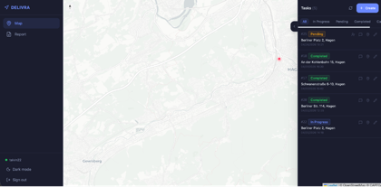
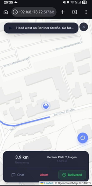
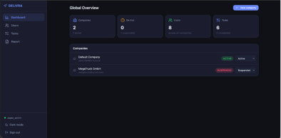

<div align="center">

# Delivra

**Multi-tenant delivery management platform with real-time tracking, in-app chat and turn-by-turn navigation.**

[](https://openjdk.org/projects/jdk/21/)
[](https://spring.io/projects/spring-boot)
[](https://react.dev/)
[](https://www.typescriptlang.org/)
[](https://www.postgresql.org/)
[](./LICENSE)

</div>

---

## Overview

Delivra is a full-stack delivery operations platform built around three roles — **dispatcher**, **driver** and **admin**. Dispatchers create and assign delivery tasks, drivers receive them and follow turn-by-turn routes computed against truck-specific constraints (height, weight, length), and admins manage companies and view platform-wide statistics. Tasks, locations and chat messages flow over WebSockets so the map and conversations stay live.

> **Status:** portfolio project. The repository is public for review; the source is proprietary — see [LICENSE](./LICENSE).

## Screenshots

<!-- Replace placeholders below with real screenshots in docs/screenshots/ -->

| Dispatcher dashboard | Driver navigation | Admin overview |
| :---: | :---: | :---: |
|  |  |  |

## Features

- **Three role-based UIs** — dispatcher, driver, admin (plus super-admin), each with its own routing and views.
- **Delivery tasks** — create, assign, search/filter, status lifecycle (`PENDING → IN_PROGRESS → COMPLETED / CANCELED`), Excel export.
- **Driver recommendation** — given a task, suggests the best driver based on location and active workload.
- **Turn-by-turn navigation** — sessions backed by the [HERE](https://developer.here.com/) Routing & Geocoding APIs, including a truck profile (gross weight, height, width, length), off-route detection, automatic re-routing with cooldown, and a traffic-tile proxy.
- **Real-time chat per task** — WebSocket (STOMP) messaging with file uploads (up to 10 MB) and read-receipt tracking.
- **Multi-tenant companies** — company registration with `TRIAL → ACTIVE → SUSPENDED` lifecycle, per-company stats, admin moderation.
- **Authentication** — JWT access + refresh tokens, email verification, password reset via mail.
- **Reports** — Excel exports generated with Apache POI.
- **Caching** — Caffeine in-memory cache.
- **API docs** — OpenAPI / Swagger UI out of the box.

## Tech stack

**Backend** &nbsp;·&nbsp; Java 21 · Spring Boot 3.3 · Spring Security (JWT) · Spring Data JPA · Spring WebSocket (STOMP) · Flyway · PostgreSQL · MapStruct · Lombok · Caffeine · Apache POI · springdoc-openapi

**Frontend** &nbsp;·&nbsp; React 19 · TypeScript · Vite · Tailwind CSS · Radix UI · React Router · TanStack Query · Zustand · React Hook Form + Zod · Leaflet (`react-leaflet`, `leaflet-rotate`) · STOMP.js · Axios · date-fns

**Infrastructure** &nbsp;·&nbsp; Docker (multi-stage) · Docker Compose · Maven Wrapper · `frontend-maven-plugin` (single-jar build)

**External APIs** &nbsp;·&nbsp; HERE Geocoding & Routing v8

## Architecture

```
┌────────────────────────┐        ┌─────────────────────────────────┐
│  React 19 + Vite SPA   │  HTTP  │       Spring Boot 3.3 API       │
│  (served from /static) │ ─────▶ │  ┌───────────────────────────┐  │
│  Leaflet · STOMP · TS  │  WS    │  │  REST  ·  WebSocket/STOMP │  │
└────────────────────────┘ ◀────▶ │  ├───────────────────────────┤  │
                                  │  │  Security (JWT)           │  │
                                  │  │  Service / Mapper / Repo  │  │
                                  │  │  Caffeine cache           │  │
                                  │  └─────────────┬─────────────┘  │
                                  └────────────────┼────────────────┘
                                                   │ JPA + Flyway
                                                   ▼
                                            ┌──────────────┐
                                            │ PostgreSQL   │
                                            └──────────────┘
                                                   │
                          ┌────────────────────────┴────────────┐
                          ▼                                     ▼
                   HERE Routing/Geocoding              SMTP (mail)
```

The frontend is built into `frontend/dist` by the `frontend-maven-plugin` and served as static resources from a single Spring Boot JAR — one artifact, one process.

## Quick start

### Option A — Docker Compose (recommended)

```bash
git clone https://github.com/Talvin22/delivra.git
cd delivra

cp .env.example .env
# edit .env: set JWT_SECRET (base64 HMAC-SHA512) and HERE_API_KEY

docker compose up -d --build
```

App: <http://localhost:8189> &nbsp;·&nbsp; Swagger: <http://localhost:8189/swagger-ui.html>

### Option B — Local development

**Prerequisites:** Java 21, Node 20, pnpm 9, PostgreSQL 16.

```bash
# 1. Database
createdb delivra

# 2. Configuration
cp .env.example .env   # then export the variables, or use an IDE run config

# 3. Backend (port 8189)
./mvnw spring-boot:run

# 4. Frontend dev server with HMR (port 5173)
cd frontend
pnpm install
pnpm dev
```

The frontend dev server proxies API calls to the backend. For a production-like build, run `./mvnw package` — the resulting JAR contains the compiled SPA and is the same artifact used in Docker.

## Configuration

All sensitive settings come from environment variables (see [`.env.example`](./.env.example)):

| Variable | Required | Description |
| --- | :---: | --- |
| `JWT_SECRET` | ✅ | Base64-encoded HMAC-SHA512 key used to sign JWTs |
| `DB_URL` | ✅ | JDBC URL, e.g. `jdbc:postgresql://localhost:5432/delivra` |
| `DB_USERNAME` / `DB_PASSWORD` | ✅ | Postgres credentials |
| `HERE_API_KEY` | ✅ | API key for HERE Geocoding & Routing |
| `WS_ALLOWED_ORIGINS` | ✅ | Comma-separated list of CORS origins for WebSocket |
| `MAIL_ENABLED` | — | `true` to enable SMTP-based notifications (default: `false`) |
| `MAIL_USERNAME` / `MAIL_PASSWORD` | — | SMTP credentials when mail is enabled |
| `APP_BASE_URL` | — | Public base URL used in outgoing emails |
| `UPLOAD_DIR` | — | Directory for chat file uploads (default: `uploads/`) |

Database migrations live under `src/main/resources/db/migration` and run automatically through Flyway on startup.

## API

Once the app is running, browse the interactive API docs:

- Swagger UI &nbsp;·&nbsp; <http://localhost:8189/swagger-ui.html>
- OpenAPI JSON &nbsp;·&nbsp; <http://localhost:8189/v3/api-docs>
- Health check &nbsp;·&nbsp; <http://localhost:8189/actuator/health>

Top-level endpoint groups: `/auth`, `/users`, `/tasks`, `/tasks/{id}/chat`, `/tasks/{id}/navigation`, `/companies`, `/admin`, `/reports`.

## Project structure

```
delivra/
├── src/main/java/site/delivra/application/
│   ├── controller/      # REST + WebSocket controllers
│   ├── service/         # business logic
│   ├── repository/      # Spring Data JPA
│   ├── model/           # entities, DTOs, enums, requests/responses
│   ├── mapper/          # MapStruct mappers
│   ├── security/        # JWT filters, auth providers
│   ├── config/          # web, security, websocket, cache, mail
│   ├── advice/          # global exception handlers
│   └── utils/           # geo / format / converter utilities
├── src/main/resources/
│   ├── application.properties
│   └── db/migration/    # Flyway SQL migrations (V1..Vn)
├── frontend/
│   └── src/
│       ├── features/    # landing · auth · dispatcher · driver · admin · report
│       ├── components/  # ui · chat · layout
│       ├── api/  hooks/  store/  lib/  types/
│       └── ...
├── Dockerfile
├── docker-compose.yml
└── pom.xml
```

## Testing

```bash
./mvnw test
```

Unit and slice tests cover services, controllers (MockMvc) and key utilities (e.g. geo distance calculations).

## License

Proprietary — All Rights Reserved. See [LICENSE](./LICENSE) for details. The repository is public for review only; reuse, redistribution or derivative works require prior written permission of the author.

## Author

**Talvin Dzaparov** &nbsp;·&nbsp; [GitHub](https://github.com/Talvin22) &nbsp;·&nbsp; talvindzaparov379@gmail.com
